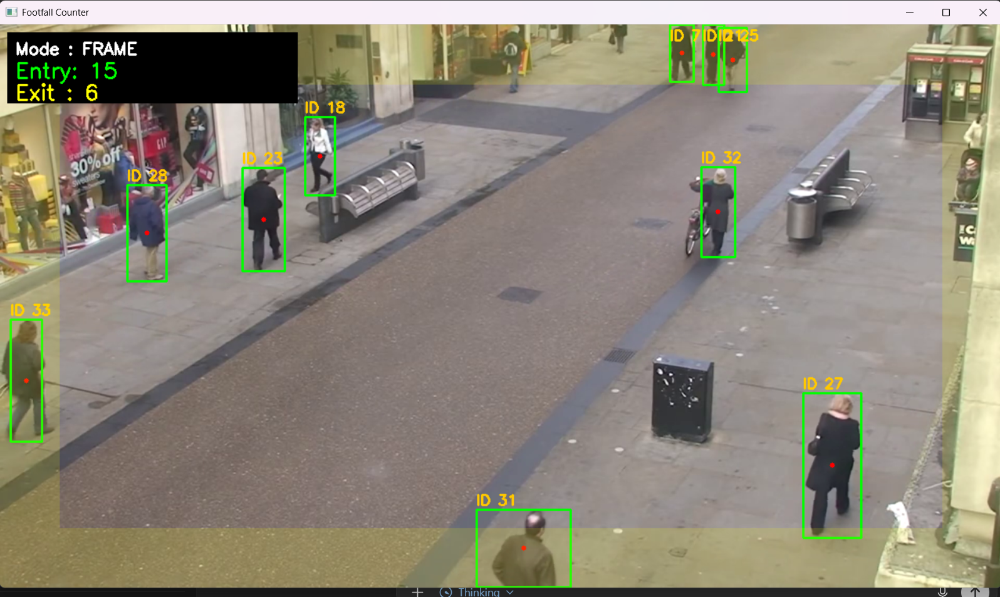
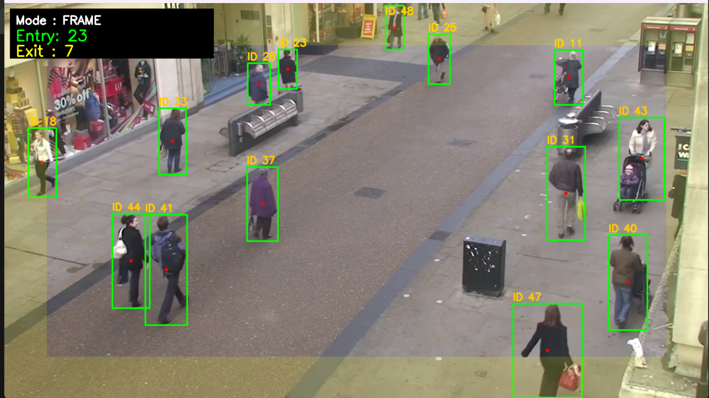

# Footfall Counter using Computer Vision

Detect, track, and **count people** as they **cross a virtual line (ROI)** using **YOLOv8** (detector) + **ByteTrack** (tracker) with OpenCV overlays.

---

## 1) Brief Description of the Approach
- **Detection:** Ultralytics **YOLOv8** runs on each frame (restricted to **COCO class 0: person**).  
- **Tracking:** **ByteTrack** (via `ultralytics.YOLO.track`) maintains **stable track IDs** across frames.  
- **ROI Line:** A virtual line **A→B** is defined with **normalized coordinates** (`--line x1 y1 x2 y2`).  
- **Robustness:** Inner/outer **hysteresis bands**, **minimum travel**, **EMA centroid smoothing**, and **per-ID cooldown** prevent jitter and double-counts.  
- **Output:** Real-time display of bounding boxes, ROI line, and live counters (Entry, Exit, Total inside), along with a **processed video output**.

---

## 2) Screenshots

<p align="center">
  
  
</p>

---

## 3) Output Demo

Here’s a short **demo video** showing the Footfall Counter in action  
(detecting, tracking, and counting people crossing the ROI line).

<p align="center">
  <video width="640" controls>
    <source src="assets/demo.mp4" type="video/mp4">
    Your browser does not support the video tag.
  </video>
</p>

👉 [Click here to watch the demo video](https://github.com/anandu91/footfall-counter-yolov8/blob/main/assets/demo.mp4)

---

## 4) Video Source Used
- **Primary dataset:** **Oxford Town Centre** (fixed street CCTV; research-use).  
  Kaggle mirror: [https://www.kaggle.com/datasets/almightyj/oxford-town-centre/data](https://www.kaggle.com/datasets/almightyj/oxford-town-centre/data)  
- **Repo input file:** `assets/Video_Input.mp4`  
  *(You can replace it with any public crowd video or your own recording.)*

---

## 5) Counting Logic (ROI Line Crossing)

1. For each tracked person, compute their **centroid** in every frame.  
2. Calculate the **signed distance** of the centroid from the ROI line.  
3. A **sign change** outside the inner band indicates a **crossing event**.  
4. Direction (`lr`, `rl`, `tb`, `bt`) determines **Entry** or **Exit** classification.  
5. Apply a **minimum travel threshold** and **cooldown per ID** to prevent duplicate counts.  

---

## 6) Dependencies & Setup Instructions

### Environment Setup
```bash
python -m venv .venv
# Windows
.venv\Scripts\activate
# macOS / Linux
source .venv/bin/activate


Install Dependencies
```bash
pip install --upgrade pip
pip install -r requirements.txt

requirements.txt
```bash
ultralytics>=8.2.0
opencv-python>=4.8.0
numpy>=1.24.0

7) Run the Project

```bash
python footfall_counter.py \
  --source assets/Video_Input.mp4 \
  --count_mode line \
  --line 0.50 0.10 0.50 0.90 \
  --direction lr \
  --margin 0.03 --inner 0.015 --mintravel 12 --cooldown 25 \
  --save assets/example_output.mp4 --show
